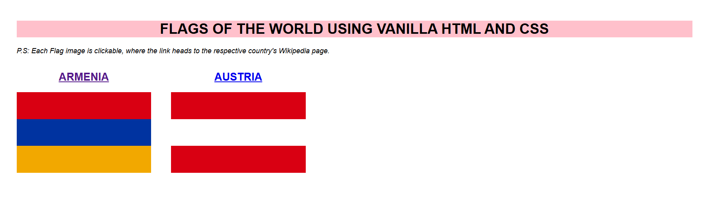

# Flags using HTML

A lightweight front-end project that showcases a few national flags built using pure HTML and CSS. Each flag is clickable and links to the relevant country's Wikipedia page.



## Overview

This project demonstrates how to create simple visual compositions using semantic HTML and styling with CSS. It is ideal for beginners learning layout, borders, color blocks, and link behavior in static web pages.

## Features

- Simple static webpage built with HTML and CSS
- Flag designs created using colored blocks and layout styling
- Clickable country names and flag sections
- No dependencies or build tools required
- Easy to open and modify locally

## Project Structure

```text
Flags-using-HTML/
├── index.html        # Main page structure and flag markup
├── style.css         # Styling for the page and flag blocks
├── image.png         # Screenshot preview of the page
└── README.md         # Project documentation
```

## Technologies Used

- HTML5
- CSS3

## How to Run

1. Download or clone the repository.
2. Open the project folder.
3. Launch `index.html` in your browser.

You can also use a simple local web server if preferred:

```bash
python -m http.server
```

Then visit `http://localhost:8000` in your browser.

## Notes

This project is intentionally simple and educational, making it a good example for learning how structure and styling work together in front-end development.

## License

This project is provided for learning and demonstration purposes.

